Welcome Gustaf Enebog,

This is the Code Institute student template for Gitpod. We have preinstalled all of the tools you need to get started. It's perfectly ok to use this template as the basis for your project submissions.

You can safely delete this README.md file, or change it for your own project. Please do read it at least once, though! It contains some important information about Gitpod and the extensions we use. Some of this information has been updated since the video content was created. The last update to this file was: **September 1, 2021**

## Gitpod Reminders

To run a frontend (HTML, CSS, Javascript only) application in Gitpod, in the terminal, type:

`python3 -m http.server`

A blue button should appear to click: _Make Public_,

Another blue button should appear to click: _Open Browser_.

To run a backend Python file, type `python3 app.py`, if your Python file is named `app.py` of course.

A blue button should appear to click: _Make Public_,

Another blue button should appear to click: _Open Browser_.

In Gitpod you have superuser security privileges by default. Therefore you do not need to use the `sudo` (superuser do) command in the bash terminal in any of the lessons.

To log into the Heroku toolbelt CLI:

1. Log in to your Heroku account and go to *Account Settings* in the menu under your avatar.
2. Scroll down to the *API Key* and click *Reveal*
3. Copy the key
4. In Gitpod, from the terminal, run `heroku_config`
5. Paste in your API key when asked

You can now use the `heroku` CLI program - try running `heroku apps` to confirm it works. This API key is unique and private to you so do not share it. If you accidentally make it public then you can create a new one with _Regenerate API Key_.

------

## Release History

We continually tweak and adjust this template to help give you the best experience. Here is the version history:

**September 20 2023:** Update Python version to 3.9.17.

**September 1 2021:** Remove `PGHOSTADDR` environment variable.

**July 19 2021:** Remove `font_fix` script now that the terminal font issue is fixed.

**July 2 2021:** Remove extensions that are not available in Open VSX.

**June 30 2021:** Combined the P4 and P5 templates into one file, added the uptime script. See the FAQ at the end of this file.

**June 10 2021:** Added: `font_fix` script and alias to fix the Terminal font issue

**May 10 2021:** Added `heroku_config` script to allow Heroku API key to be stored as an environment variable.

**April 7 2021:** Upgraded the template for VS Code instead of Theia.

**October 21 2020:** Versions of the HTMLHint, Prettier, Bootstrap4 CDN and Auto Close extensions updated. The Python extension needs to stay the same version for now.

**October 08 2020:** Additional large Gitpod files (`core.mongo*` and `core.python*`) are now hidden in the Explorer, and have been added to the `.gitignore` by default.

**September 22 2020:** Gitpod occasionally creates large `core.Microsoft` files. These are now hidden in the Explorer. A `.gitignore` file has been created to make sure these files will not be committed, along with other common files.

**April 16 2020:** The template now automatically installs MySQL instead of relying on the Gitpod MySQL image. The message about a Python linter not being installed has been dealt with, and the set-up files are now hidden in the Gitpod file explorer.

**April 13 2020:** Added the _Prettier_ code beautifier extension instead of the code formatter built-in to Gitpod.

**February 2020:** The initialisation files now _do not_ auto-delete. They will remain in your project. You can safely ignore them. They just make sure that your workspace is configured correctly each time you open it. It will also prevent the Gitpod configuration popup from appearing.

**December 2019:** Added Eventyret's Bootstrap 4 extension. Type `!bscdn` in a HTML file to add the Bootstrap boilerplate. Check out the <a href="https://github.com/Eventyret/vscode-bcdn" target="_blank">README.md file at the official repo</a> for more options.

------

## FAQ about the uptime script

**Why have you added this script?**

It will help us to calculate how many running workspaces there are at any one time, which greatly helps us with cost and capacity planning. It will help us decide on the future direction of our cloud-based IDE strategy.

**How will this affect me?**

For everyday usage of Gitpod, it doesn’t have any effect at all. The script only captures the following data:

- An ID that is randomly generated each time the workspace is started.
- The current date and time
- The workspace status of “started” or “running”, which is sent every 5 minutes.

It is not possible for us or anyone else to trace the random ID back to an individual, and no personal data is being captured. It will not slow down the workspace or affect your work.

**So….?**

We want to tell you this so that we are being completely transparent about the data we collect and what we do with it.

**Can I opt out?**

Yes, you can. Since no personally identifiable information is being captured, we'd appreciate it if you let the script run; however if you are unhappy with the idea, simply run the following commands from the terminal window after creating the workspace, and this will remove the uptime script:

```
pkill uptime.sh
rm .vscode/uptime.sh
```

**Anything more?**

Yes! We'd strongly encourage you to look at the source code of the `uptime.sh` file so that you know what it's doing. As future software developers, it will be great practice to see how these shell scripts work.

---

Happy coding!


Deployed Site
https://gustafenebog.github.io/project-2/


# Parametric Wing planform Design App
This App creates a simple top-view drawing of a wing based on parametric input such as wing span, chord and sweep given by the user. This design method, called parametric Design, is the other way around to the case where the user first use a CAD or a drawing software to draw the wing and only afterward recieve or having to calculate the characteristic wing design parameters. This way of designing lends itself better for otimization algoritms.
The app is particilary usefull for hobbyist designing model airplanes as well as in Aircraft Conceptual Design (especially as more parameters and featers are added) since the Designer imediatly recieves updated graphics to his inputed numbers.

[View the live project here.](https://gustafenebog.github.io/project-2/)


## Features

### Favicon
+ The favicon is made up by the W in the WINGIT-logo.
+ The favicon has been produced in all relevant file formats.


The Drawing Area
    Calculating the wing planforms width and Height as well as its ratio. 'getDrawingWidth'-function which in turn calls upon the 'getDrawingSize'-function. 'getDrawingHeight'-function

    Moving potentially negative values (as in the case when a forward sweep wing panel moves ahead of the root leading edge). 'getNegXCompFactor'-function calculates this factor and it is applied in the 'compensateNegX'-function.

    Calculating the factor (zoomFactor) and applying this to the plot coordinates in order to make the drawing the same size as the drawing sizes (canvas size of, width: 320px; height: 569px;). Responsible for this is the function 'getZoomFactor'

    Plotting the drawing using different line weights and both solid and dashed line
sweepP1XC
sweepP2XC
sweepP3XC
sweepP1YC
sweepP2YC
sweepP3YC
outlineP1XC
outlineP2XC
outlineP3XC
outlineP1YC
outlineP2YC
outlineP3YC
    The Input/Output Area
    help section and tool tips
      delay in displaying tooltip
    Dark Mode
      Toogle button
    complete input feedback/confirmation
    Input
      live update using eventlistener for input
        'funcForEvent'-function
      Alert message
    Output
      Calculation of wing parameters (output) based on other wing parameters (input) using standard equations
      Commensinc calculation of output paramaters only as all neccesary input parameters has been inputed (solved by if-statements)
    x


### The Drawing Area

  + The header features the artist Enebog-logo to the left and the four navigation links: Home, Works, About, Contact (for larger devices) or the “hamburger” icon (for smaller devices) to the right.
  + This is a single page scrolling website (with the exception of the individual art-piece-display pages the user is taken to when clicking on an art piece on the main page). These takes the user to the correct section, within the page, when a link is clicked.
  + The header with its nav elements is always fixed  (except on the individual art-piece-display pages) and creates therefore a quick and easy to understand navigation experience.
  + The Enebog-logo also doubles as an extra home button.
  + On larger devices the navigation is lined up in a row on the right side of the header.
  + The navigation links for large screen devices are being underlined when hoovered over.
  + A click anywhere on the individual art display page takes the user back top of the main page.  


### "Hero”-image
  + The top of the page features a high-resolution image of an art piece with a text overlay to give the user a wow-effect and at the same time highlighting upcoming events.


### The Works-section
  + The Works-section displays three galleries with nine art pieces each displayed in a 3x3 grid.
  + The images of the art-pieces zooms to a larger size when hovered on larger displays (see the zoomed image of the braided flask below).
  + The user can click an art-piece if he want to see a larger display of it.
  + Currently the display page of only one art pieces has been implemented which is the first image (braided flask).


### The full-size display-page
  + When an art piece is clicked in the Works-section the user is taken to a separate display page (unique for each art piece) where the art is annotated and display in a larger size.


### The ABOUT-section
  + This section features a photo of the artist together with a short bio explaining his process, favorite motives and mediums and his reasons for drawing and painting.
  + A splach of white ink (taken from the Enebog-logo) has been added as an accent.


### The Contact-section with form
  + The contact section provides postal address, email and telephone number to the artist. All fields (except subject) are reqiered to be filled in and filled in correctly before the message is allowed to be submitted.
  + The contact section also provide a form which the user can use as a way of reaching out to the artist directly.
  + The bright orange submit-button acts here as a "call-to-action" button, the action being to reach out to the artist.


### The Footer
+ The footer contain icons linking to all the places the artist can be found in social media including a link to the London based online gallery, Artfinder, where Enebog’s art can be acquired.


### Features remaining to be implemented
+ Completing a Dark Mode alternative interface. The button (with javascript-code) to toggle back and forth between the dark and the default light mode is already created but has been removed since the feature/function not yet is complete.
+ A 500 ms delay for the tooltips to appear (no delay for them to disapear)
+ Removing the frame around the drawing (canvas)
+ Implementing more parameters, e.g. Aerodynamic Center, a.c. AC ac
Neutral Point, n.p. NP
Center of Gravity, c.g. CG
Static Margin, s.m. SM
Horisontal Tail Volume, VH
Control Surface Root Chord, csc,r
Control Surface Tip Chord, csc,t
Control Surface Start, bsc,r
Control Surface End, bsc,t
LE or TE

+ Implementing more featuers, e.g. 

•	YES: Expanding input matrix depending on two inputs (one nested into the other)
o	Nr. of wings
	Nr. of panels
•	YES: Choosing unit (%, cm or m) next to input in a drop down menu
•	YES: no “calculate”-button! Instead each making of an entry update the parameters and drawing
•	MAYBE: Pop up instruction window upon hoover (after  1 or 2 sec.) showing also equations
•	MAYBE: Color in input/output field characterising value
•	MAYBE: Wings but to but alternative radio-button
•	Let drawing (white background) field expand to wing + breathing space all around and input value grow to fit (do together with min and max height/width). OR is this too dynamics
•	NO: simple drawing top view

+ Make drawing area adapting to available view port instead of having to resort to the current fixed size of 320px X 569px.

## Design
+ Inspiration for this clean minimalistic design came from many sites and tools including monday.com and xxxxx

Since the users can be expected to often be older and less IT-savvy the website needs to be very simple and intuitive and should remain so even if more content is being added. The solution to this is a single page website with a header where the logo and navbar is always visible. As this is an artist website showing of Art, the Surface Plane with its graphics is arguably more important than the sites functional features (providing they all work, that is) since this is to work in concert with, and enhance the content. The minimalistic, uncluttered, and sober graphics of the site are not only modern and user friendly for less it-savvy artist lovers but it does also provide the perfect setting for displaying art much like the simple white walls in a real art gallery.

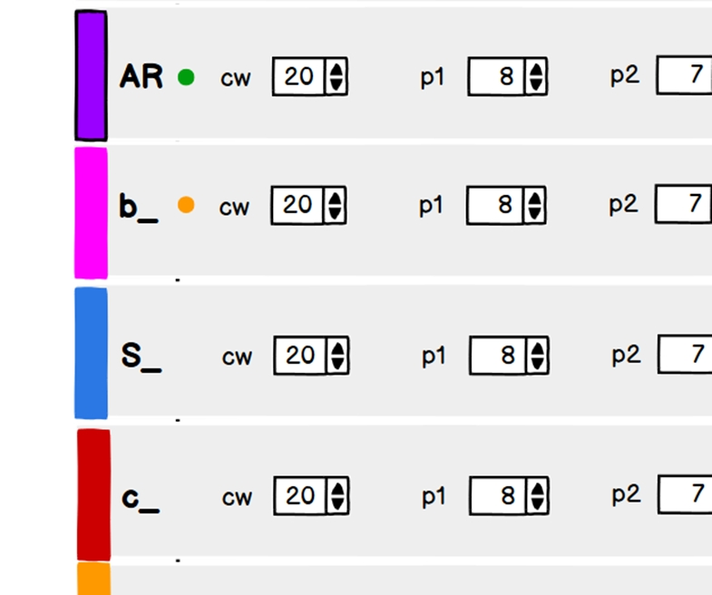
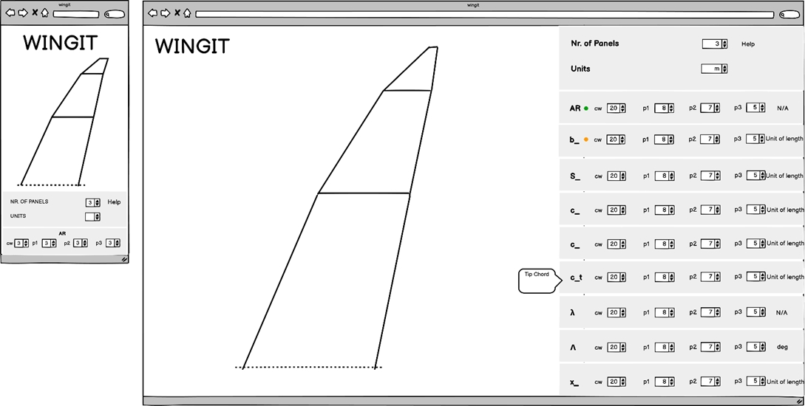
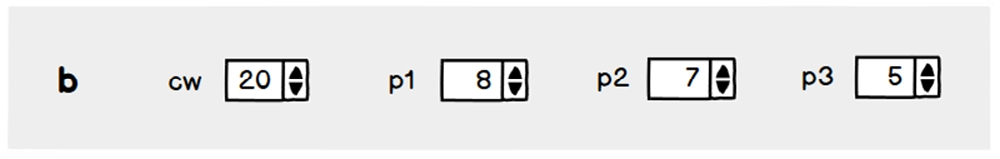
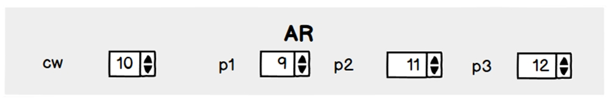
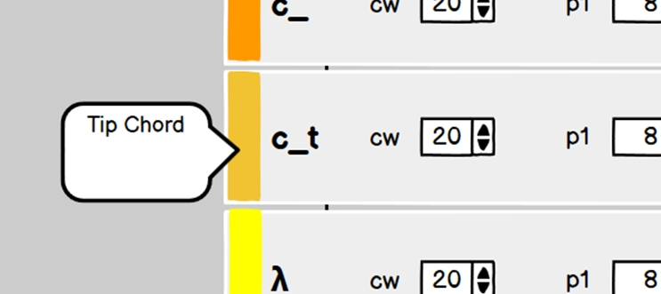
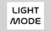
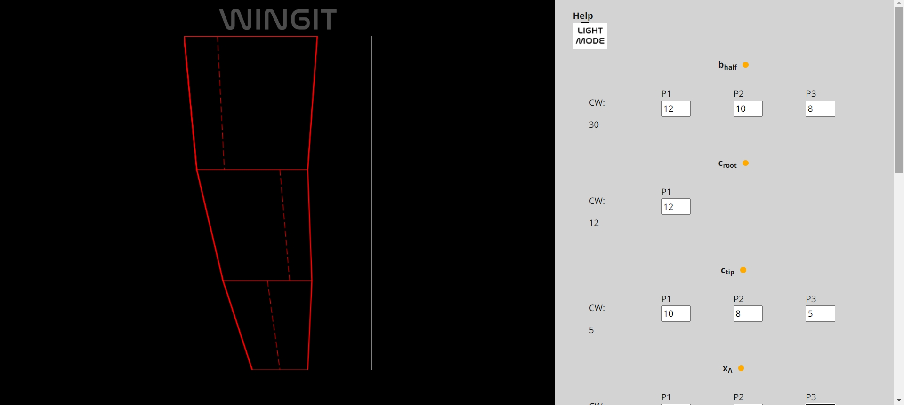
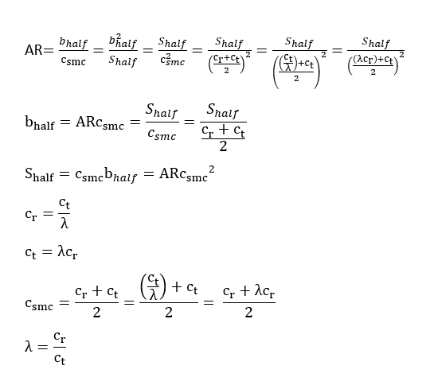
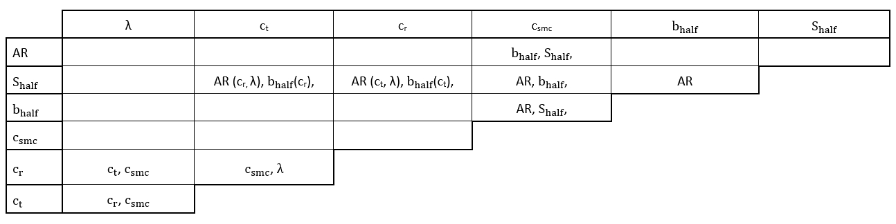

### Colors
+ The Grey and White color theme provides a color-neutral background setting the stage for potnetial colorcoding. 

+ A Dark Mode including a button toggling between dark and luight mode has been prepared yet removed since it is not yet complete

### Typography
A font-matching-tool has been used to test combinations of "header-fonts" and "paragraph-fonts" however its advice was ultimately discarded for a "gut-feel" to pick the single font "Open Sans Regular 400" with "Montserrat" as a fallback font and sans-serif as the fallback to that.

## Miscellanious
+ As much as it is good practise to keep variables local and to avoid global variables it is sometimes necessary and this code is such an example where relativly many global variables was necessary or the code structure would have had to become very complicated.

## Technologies Used
+ HTML5
+ CSS3
+ [Google Fonts:](https://fonts.google.com/) To import font family "Open Sans Regular 400", "Montserrat" into the style.css file which is used on all pages.
+ [Font Awesome:](https://fontawesome.com/) used in footer section to social icons and "hamburger"-icon in navbar for smaller devices.
+ [Balsamiq:](https://balsamiq.com/) Super nice program for creating wireframe drafts of the website.
+ [Fontpair:](Fontpair.co) was used to test combinations of fonts.
+ [Krita:](https://krita.org/en/) Used for creating, editing and re-sizing images (bitmap art).
+ [Clip Studio Paint:](https://www.clipstudio.net/en/) Used for creating and editing vectorgraphics (as well as bitmap-art) such as the Enebog-logo.
+ [Am I Responsive:](http://ami.responsivedesign.is) Checking the responsiveness and generating the image in the beginning of this document showing my website on different devices/screensizes.
+ [GitPod](https://www.gitpod.io/) GitPod has been used as a cloud based IDE from which code was commited and pushed to GitHub.
+ [GitHub:](https://github.com/) GitHub is used to store the code that has been pushed from GitPod.

## Testing
### Manual testing
+ I have manually tested that:
  + The most complex function in the code (cyclomatic complexity rating of 13) can be considered "More complex to understand" and with a "moderate risk to modify" whereas the median function (cyclomatic complexity rating of 5) can be considered as a "Simple procedure to understand" and with a "little risk to modify"
	+ the "tool tip on hover" (also known as screentips) all work.
  + Wrong input, e.g. letters are not accepted, decimal numbers!!!
	+ wrong input, e.g. email address field without an @-sign receive a complaint as well as a form submission-button-click results in a confirmation page.
  + Responsive design shifts correctly at the breakpoint (width: 576px) between the drawing- and the input-output-area stacked (mobil) and side-by-side (inline) for larger devices

+ Manual testing has been carried out on:
  + Different browsers: Except Chrome the website has also been tested in Firefox (Safari as not been tested) where a a bug in the form element was appearing.
  + Responsiveness using different standard screen sizes testing the responsive design.
  + name, email and message is required to submit the form in the contact section.
  + the email input field must contain @ symbol to submit the form in the contact section.
  

### Validator Testing
+ All code was tested for syntactical errors with perfect results using official validators (Java Script 62 warnings all relating to potential compability issies with java script or browser versions) :
  + HTML using the W3C-the official validator for html-code (https://validator.w3.org/)

  + CSS using Jigsaw-the official validator for CSS-code (https://jigsaw.w3.org/css-validator/)

  + Java Script using the JSHint validator for Java Script-code (https://jshint.com/)
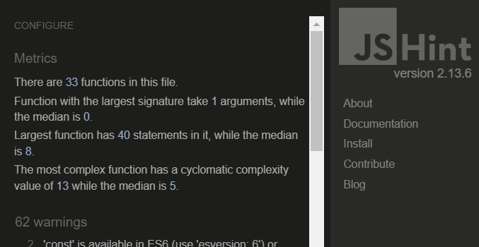
  + performance, accessibility, SEO etc. using Lighthouse in Chrome developer tools.

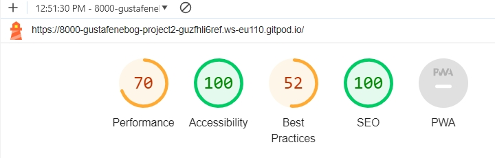
  + The low performance scoore is inherent for a calculation-heavy App and with the live update adding insult to injury.

+ The code was also beautified using GitPods built in beautifyer.

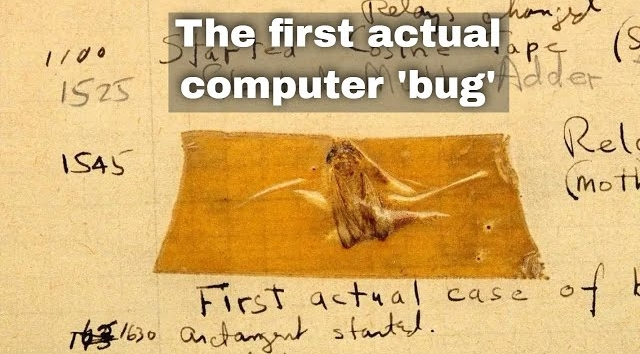
### Bugs
+ Fixed bugs:
  + Change in logo and header height would not come through due to conflicting css-rules.
  + Page overflowed horizontaly (slider appeared).
  + "Underline on hover" in large display navbar disapeared due to a typo.
  + Hamburge-icon could not be vertically centered.
  + One-page-scroll-navigation stopped to far down in the work-, about- and contact-sections.
+ Remaining bugs:
  + The form flows down into the footer (or vice versa) in Firefox.
  + The "click-anywhere-on-page"-link on the display page has stopped working in the last versions.

### Deployment
+ Go to your GitHub repo and choose the **settings** tab and then **Pages** on the left-hand sidebar and then make sure that the following is set as below:
  + **Sources** is set to ‘Deploy from Branch’
  + **Main** branch is selected
  + **Folder** is set to / (root)
+ Click save and go back to the **Code** tab and wait a few minutes for the build to finish. Make sure that you do not push to the repo during this time since this will cause the rebuild to fail.
+ Go to the **github-pages** under the **Deployment** section, further down on the right hand side.
+ Now you can see the URL to your deployed site under **Active deployments**. Click on the URL to go to your site. The URL will follow the following format: your-username.github.io/your project name/


## Credits

### Readme
+ Inspiration for this readme-file has been taken from the readme-files of:
  + Code Institute "Coding Club"
  + Code Institues "Love Running"
  + My Bonsai Page by mittnamnkenny

### Code
+ The code for the header with navbar, form and footer from Code Institute's "Love Running" was used as a starting point for my code.
+ Code that is supposed to making the whole page clickable (not just back arrow) is taken from a forum however I am sorry to say that I have not been able to retrieve the source back to give credit.
+ "Zoom on Hoover" code snippet from 3W Schools (https://www.w3schools.com/howto/howto_css_zoom_hover.asp) has been used and modified to make images in the galleries in the work-section zoom when they are being hovered.

### Earlier implementation
+ The Features and Design sections has been based on Jesse James Garretts five pillars of webdesign.
+ Enebog art has already been implemented in a Squarespace-template-version. This new version has a changed design and it improves on weak points of the Squarespace-version:
  + The all-important art was not displayed directly upfront but one or two clicks away.
  + Even after one click all of the art was not displayed in a single grid but required the user to step through each gallery one picture at a time.
  + The about and contact sections was separated albeit they fitted well together.

### Acknowledgement
A special thanks to my mentor at Code Institute for his time, nice ways and for most helpful input!