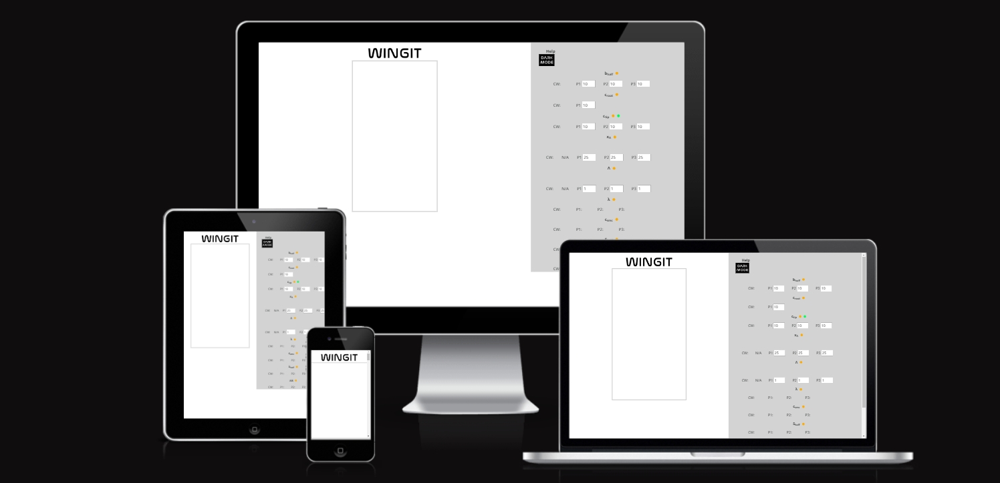
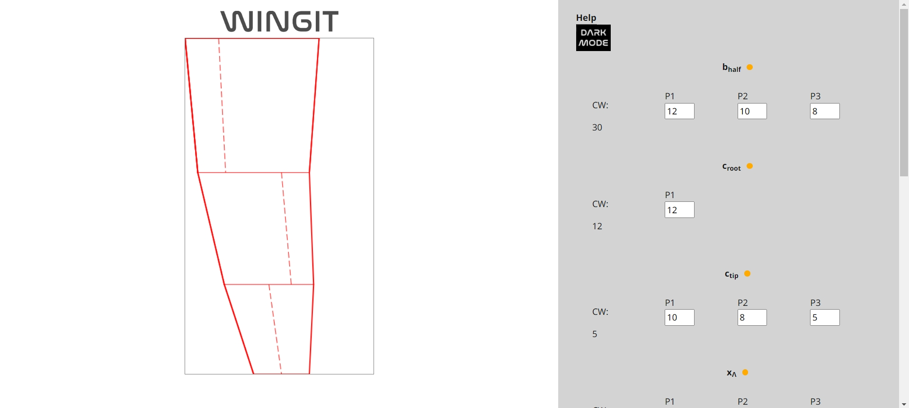
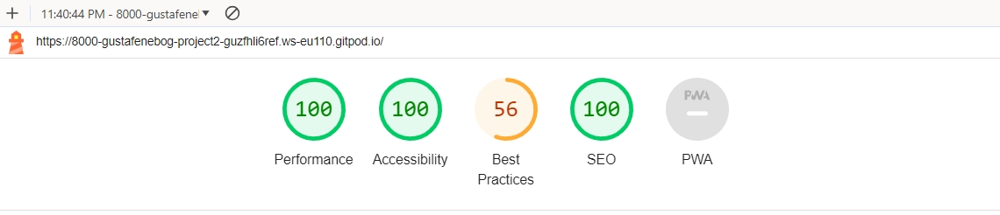

[View the live project here](https://gustafenebog.github.io/project-2/)

# Parametric Wing planform Design App
This App creates a simple top-view drawing of a wing based on parametric user-input such as for example wing span, chord and sweep. This way of designing lends itself better for otimization algoritms and works the other way around to when a designer/user first use CAD/drawing-software to first draw the wing and afterward recieve or having to calculate the wing design parameters.

The app is particilary usefull for hobbyist designing model airplanes as well as (as more features and parameters are being added) for Aircraft Conceptual Designers since the user imediatly recieves a live updated graphics to his inputed numbers.

## Index – Table of Contents
* [User Experience (UX)](#user-experience-ux) 
* [Features](#features)
* [Design](#design)
* [Miscellanious](#miscellanious)
* [Technologies Used](#technologies-used)
* [Testing](#testing)
* [Deployment](#deployment)
* [Credits](#credits)

## User Experience (UX)
As a user I want to be able to :

+ Easily determine the purpose of the website.
+ Play around (step up and down or type in form field) with different values of Wing Design Parameters to view...
  + A live updated drawing of the wing planform
  + live updated dependent parameters outputed as they are calculated using the inputed independent parameters
+ View graphical legend defining the characteristic Wing Design Parameters in the form of a hover over tool tip
+ View legends for variable symbols in the form of hover over tool tip
+ Toogle between a default light mode and a dark mode.

## Features

### The Drawing Area
    Calculating the wing planforms width and Height as well as its ratio. 'getDrawingWidth'-function which in turn calls upon the 'getDrawingSize'-function. 'getDrawingHeight'-function

    Moving potentially negative values (as in the case when a forward sweep wing panel moves ahead of the root leading edge). 'getNegXCompFactor'-function calculates this factor and it is applied in the 'compensateNegX'-function.

    Calculating the factor (zoomFactor) and applying this to the plot coordinates in order to make the drawing the same size as the drawing sizes (canvas size of, width: 320px; height: 569px;). Responsible for this is the function 'getZoomFactor'

    Plotting the drawing using different line weights and both solid and dashed line
sweepP1XC
sweepP2XC
sweepP3XC
sweepP1YC
sweepP2YC
sweepP3YC
outlineP1XC
outlineP2XC
outlineP3XC
outlineP1YC
outlineP2YC
outlineP3YC
    The Input/Output Area
    help section and tool tips
      delay in displaying tooltip
    Dark Mode
      Toogle button
    complete input feedback/confirmation
    Input
      live update using eventlistener for input
        'funcForEvent'-function
      Alert message
    Output
      Calculation of wing parameters (output) based on other wing parameters (input) using standard equations
      Commensinc calculation of output paramaters only as all neccesary input parameters has been inputed (solved by if-statements)
    x

### The Input/Output Area

### Maths and Algorithms

Reason for sizing drawing coordinates to match canvas coordinates is becasue canvas is a bitmap and not a svg ()
Unlike Scalable Vector Graphics (SVG) the html element "Canvas" is a bitmap which pixelate when scaled up. For this reason it is very important to scale up the drawing to the same (or larger) size as the canvas size.

### Features remaining to be implemented
+ Implementing more parameters, e.g:
  + Aerodynamic Center, AC
  + Neutral Point, n.p.
  + Center of Gravity, c.g.
  + Static Margin, s.m.
  + Horisontal Tail Volume, VH
  + Control Surface Root Chord, csc,r
  + Control Surface Tip Chord, csc,t
  + Control Surface Start, bsc,r
  + Control Surface End, bsc,t
  + Control Surface at LE, TE or inbetween
  + etc.
+ Implementing more featuers, e.g. 
  + Free chooise of nr. of wings
  + Free chooise of wing panels
+ More display options (toggle with radiobuttons)
  + Implement radiobuttons (and functionality) for:
  + Showing right wing half instead of left as is now the case (write function that multiples y-coordiantes with -1 and then subtracts half span)
  + Showing the whole wing, i.e. both left and right wing halves (write functions that subtracts half span to left wing half and then add right wing half)
  + Rotate wing into a horisontal position (write function that transposes plot coordiantes or use the [canvas rotate method](https://www.w3schools.com/jsref/canvas_rotate.asp)
+ Make drawing- (canvas) area adapt (responsive design) to available view port instead of having to resort to a fixed size (currently set to 320px X 569px) 
+ Evaluating if a revision of the code structure and handling of events could allow the number of global variables to be reduced.
+ A 500 ms delay for the tooltips to appear after having been hovered over (no delay for them to disapear)
+ Completing a Dark Mode alternative interface. The button (with javascript-code) to toggle back and forth between the dark- and the default light- mode is already created but has been removed since the feature is not yet fully working.

## Design
+ The interface is simple and plain with and a focus on the relevant aspects, the drawing and the input/output area. The drawing area is at top, (below the breakpoint) and to the left (above the breakpoint) and the opposite for the input/output area.

interface
Inspiration for this clean minimalistic design came from many sites and tools including monday.com and xxxxx

The useage of tool tips allows the design to be less cluttered yet still having the information easily accessible

### Logo

### Colors
+ The Grey and White color theme provides a color-neutral background setting the stage for potential colorcoding.

lightgrey #d3d3d3 or rgb(211, 211, 211)

## Features

### Favicon
+ The favicon is made up by the W in the WINGIT-logo.
+ The favicon has been produced in all relevant file formats.

### Typography
Noto Sans has been used as a font since it features greek letters necessary for the some of the input/output parameters. "Montserrat" and sans-serif is used as fallback fonts.

## Miscellanious
+ As much as it is good practise to keep variables local and to avoid global variables it is sometimes necessary and this code is such an example where relativly many global variables was necessary or the code structure would have had to become very complicated.

## Technologies Used
+ [HTML 5 -](https://html.spec.whatwg.org/multipage/) App structure and content
+ [Canvas (2D) element in HTML 5 -](https://www.w3schools.com/html/html5_canvas.asp) Bitmap drawings of wing planform
+ [CSS3 -](https://www.w3.org/TR/CSS/#css) App styling
+ [Java Script -]( https://262.ecma-international.org/6.0/) Interactivity
+ [Google Fonts -](https://fonts.google.com/) Import used font families
+ [Balsamiq -](https://balsamiq.com/) Wireframe drafts
+ [Krita -](https://krita.org/en/) Creating and editing images (bitmap)
+ [Clip Studio Paint -](https://www.clipstudio.net/en/) Creating and editing images (vectorgraphics and bitmap)
+ [Am I Responsive -](http://ami.responsivedesign.is) Responsiveness check and generating multi-device image in the begin of this readme
+ [GitPod -](https://www.gitpod.io/) Cloud based IDE
+ [GitHub -](https://github.com/) Cloud based code storage

## Testing
### Manual testing
+ I have manually tested that:
  + The most complex function in the code (cyclomatic complexity rating of 13) can be considered "More complex to understand" and with a "moderate risk to modify" whereas the median function (cyclomatic complexity rating of 5) can be considered as a "Simple procedure to understand" and with a "little risk to modify"
	+ That all output parameters have been calculated correctly
  + the "tool tip on hover" (also known as screentips) all work.
  + Wrong input, e.g. letters are not accepted, decimal numbers!!!
	+ wrong input, e.g. email address field without an @-sign receive a complaint as well as a form submission-button-click results in a confirmation page.
  + Responsive design shifts correctly at the breakpoint (width: 576px) between the drawing- and the input-output-area stacked (mobil) and side-by-side (inline) for larger devices

+ Manual testing has been carried out on:
  + Different browsers: Chrome, Firefox, Edge and Safari
  + Laptop, tablet (Ipad Air 5) and mobile (Samsung Galaxy A50 and Iphone 11)
  + Responsiveness using the device toolbar in Dev tools

### Validator Testing
+ All code was tested for syntactical errors with perfect results using official validators (Java Script 62 warnings all relating to potential compability issies with java script or browser versions) :
  + HTML using the W3C-the official validator for html-code (https://validator.w3.org/)

  + CSS using Jigsaw-the official validator for CSS-code (https://jigsaw.w3.org/css-validator/)

  + Java Script using the JSHint validator for Java Script-code (https://jshint.com/)

  + performance, accessibility, SEO etc. using Lighthouse in Chrome developer tools.

  + The low performance scoore is inherent for a calculation-heavy App and with the live update adding insult to injury.

+ The code was also beautified using GitPods built in beautifyer.

### Bugs
+ Fixed bugs:
  + The most evil and headachy (if that is a word) bug of the project was the drawing overflowing the canvas boundary. The bug fix was to not only set the canvas width="320" height="569" in the CSS-file but also directly in the canvas element in the html-file. The solution came as a result of determining that all the plot coordinates where correct using dev-tools (see below compilation of error elimination). The deceptivness of this bug was that canvas seem to be working with two different sizes yet dev tools was showing only one of these.

+ Remaining bugs:
  + The drawing coordinates are erronious () for sweep angle, Δ of 0 which is why this angle is taken out of the allowed input range the sweep angle, Δ. For this reason the negative sweep angle, Δ unfortunatly also becomes unavailable despite being in full working order.

### Deployment
+ Go to your GitHub repo and choose the **settings** tab and then **Pages** on the left-hand sidebar and then make sure that the following is set as below:
  + **Sources** is set to ‘Deploy from Branch’
  + **Main** branch is selected
  + **Folder** is set to / (root)
+ Click save and go back to the **Code** tab and wait a few minutes for the build to finish. Make sure that you do not push to the repo during this time since this will cause the rebuild to fail.
+ Go to the **github-pages** under the **Deployment** section, further down on the right hand side.
+ Now you can see the URL to your deployed site under **Active deployments**. Click on the URL to go to your site. The URL will follow the following format: your-username.github.io/your project name/

## Credits

### Readme
+ Inspiration for this readme-file has been taken from the readme-files of:
  + ANAGRAM word puzzle website by elainebroche
  + rock-paper-scissors by mittnamnkenny

### Code
+ The code Institute tutor for help on the eventlistener and dark mode toggle button.
+ API Code snippet for tool tips from 3W Schools https://www.w3schools.com/howto/howto_css_zoom_hover.asp

### Acknowledgement
A special thanks to my mentor at Code Institute for his time, nice ways and for most helpful input!